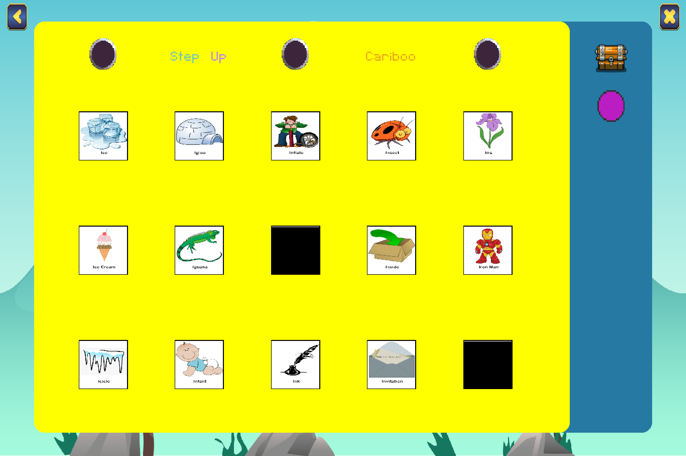

# The Speech Games

The Speech Games is an interactive game built in Python using the Pygame library. It’s designed to support speech therapy sessions with children, helping them practice specific words in a fun and engaging way.

The main game, Cariboo, features panels displaying images of various objects. A child must correctly say the word shown on a panel before clicking to open it. If a ball is hidden behind the panel, it appears on the right side of the screen. Once all four balls are found, the game concludes with a reward animation, adding excitement and motivation.

For the therapist or instructor, the game includes customization options such as selecting which speech sounds to target and choosing the reward animation shown to the child, creating a more personalized and effective learning experience.

## How to Run the Game
There is an installer available for the game that installs a .exe file to be used in Windows based machines. On other machines, it is recommended to just clone the repository and run main.py using your Python interpreter. The game does require that the PyGame, tkinter, and SQLite3 libraries. Please install those first if you are using main.py to run the game.

## Code Usage
This project is open-source so others can use it, learn from it, and build upon it. I make most of my projects open-source to encourage collaboration and support other developers in creating their own applications. You’re welcome to use or adapt any part of this code to help bring your ideas to life.
